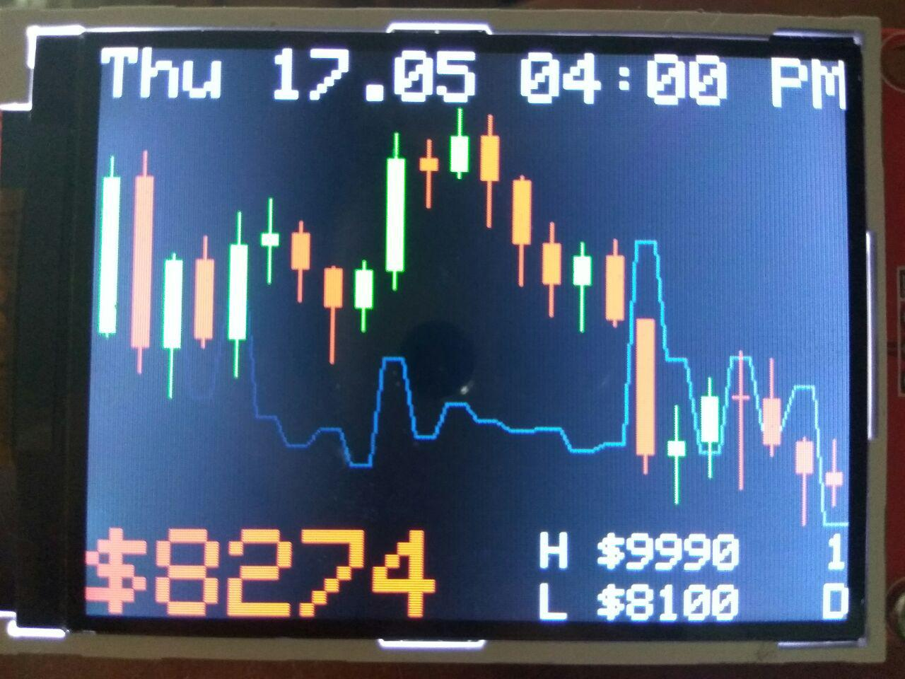

# Bitcoin ticker with candle chart
### (any crypto listed on Binance is supported)

Uses Binance REST API for building initial candles and
Binance WebSockets API to update candles and price in real time.
Has 2 buttons for switching between cryptos and timeframes.

# Displays
* Date and time
* Candle chart with volume for selected crypto and timeframe
* The latest price
* HIGH and LOW for the displayed period
* Selected crypto and timeframe (e.g. 1h means each candle is 1 hour)
### Everything is updated in realtime via WebSockets

# Components
* NodeMCU ESP8266
* SPI TFT display ILI9341 (320x240)
* push button x2
* 10 kΩ resistor x2
* wires to connect everything together

# Connections
### display
* 3.3v to display VCC
* GND to display GND
* D2 to display CS
* RST to display RESET
* D1 to display DC
* D7 to display SDI/MOSI
* D5 to display SCK
* 3.3v to display LED
* D6 to display SDO/MISO
### buttons
* D0 to GND via 10 kΩ resistor and also to 3.3v via a push button
* D8 to GND via 10 kΩ resistor and also to 3.3v via a push button

# Donation
BTC: bc1q6e69ykp7lf22xwtzpnqqyvedak9raugmtvp666
