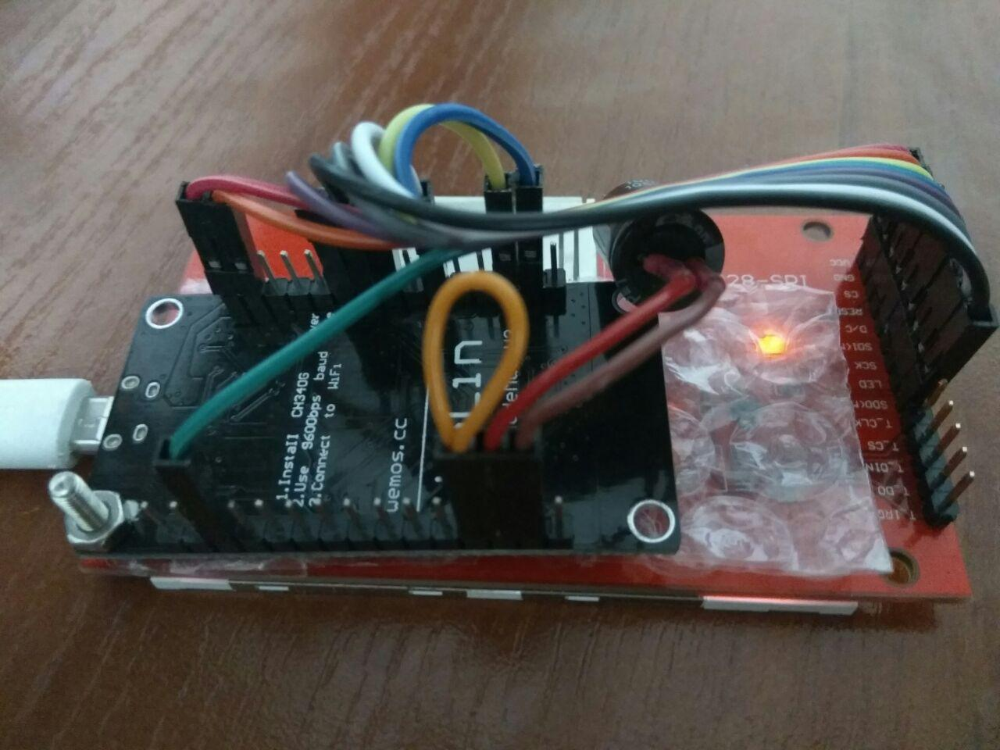

# bitcoin-ticker

Displays current BTC price, candle chart and time.
Uses SPI TFT display ILI9341 (320x240) and NodeMCU programmed with Arduino IDE.

# API
Binance REST API for drawing charts and Binance Web Sockets API to update candles and price.

# Connections

# Donation
BTC: bc1q6e69ykp7lf22xwtzpnqqyvedak9raugmtvp666
